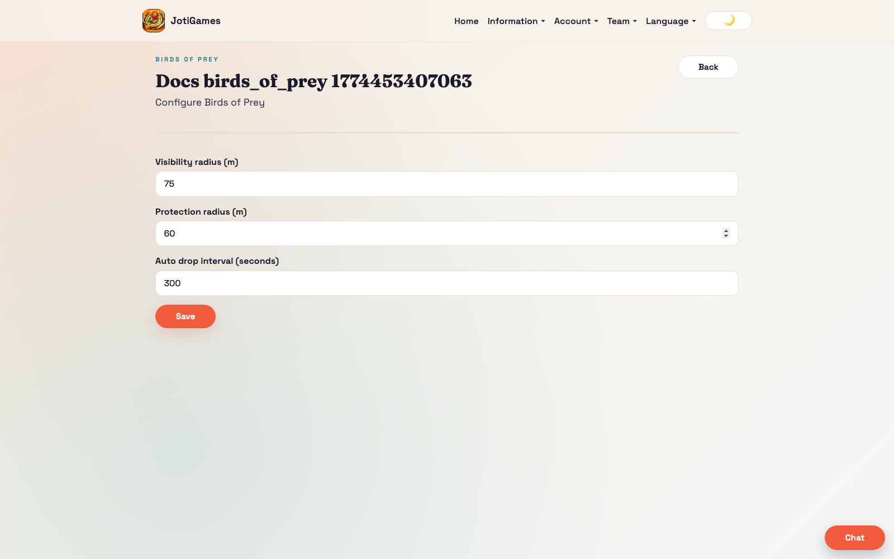
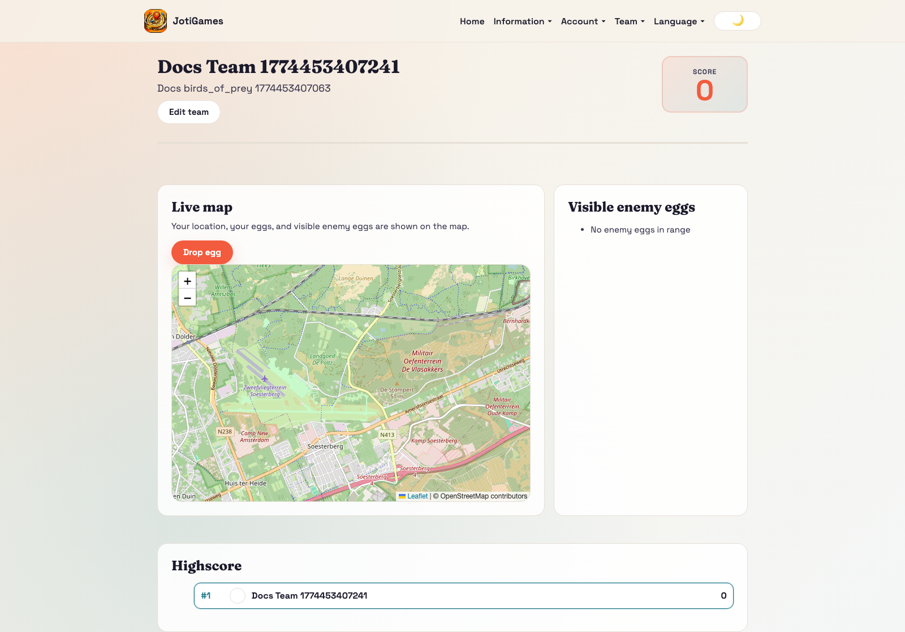
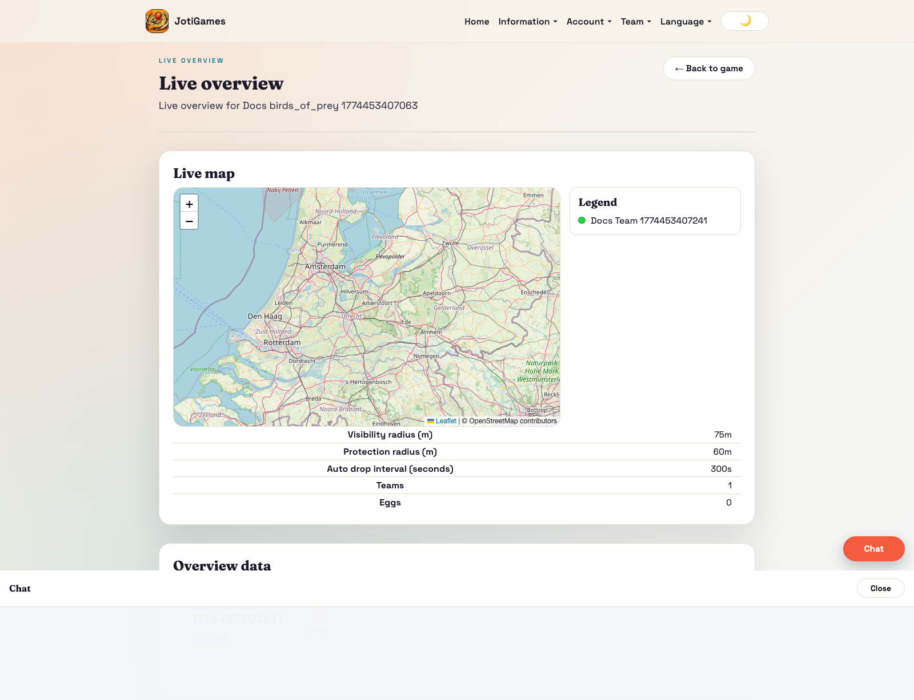

# Birds of Prey

## Objective

Score by dropping protected eggs and destroying enemy eggs.

## Core flow

1. Admin configures visibility radius, protection radius, and auto-drop interval.
2. Teams drop eggs manually (or via auto-drop worker).
3. Enemy eggs become visible within configured range.
4. Enemy eggs can be destroyed only outside protection constraints.
5. Scores and egg lifecycle update live for teams and admins.

## Relevant pages

- Admin configure: `/admin/birds-of-prey/:gameId/configure`
- Admin live overview: `/admin/games/:gameId/live-overview`
- Team dashboard panel: `/team`

## Page descriptions

- Configure page: visibility/protection radius and auto-drop interval.
- Team dashboard panel: own eggs, visible enemy eggs, drop/destroy actions.

## Screenshot

## Runtime screenshots

### Team dashboard (`/team`)

Shows egg lifecycle controls for players: own eggs, nearby enemy eggs, and drop/destroy actions.

### Admin live overview (`/admin/games/:gameId/live-overview`)

Shows live egg entities, team pressure, and score movement for intervention during active rounds.

## Realtime highlights

- self updates, visible enemy eggs
- egg add/remove
- team score updates

## Operational dependency

- `backend/scripts/birds_of_prey_auto_drop_eggs.py`
