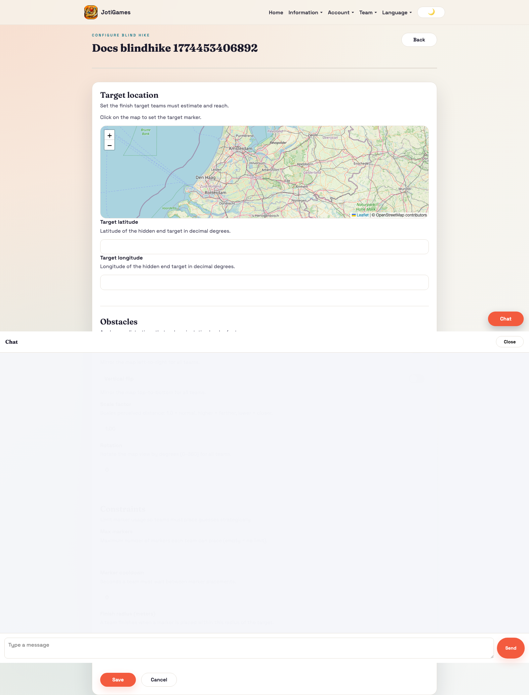
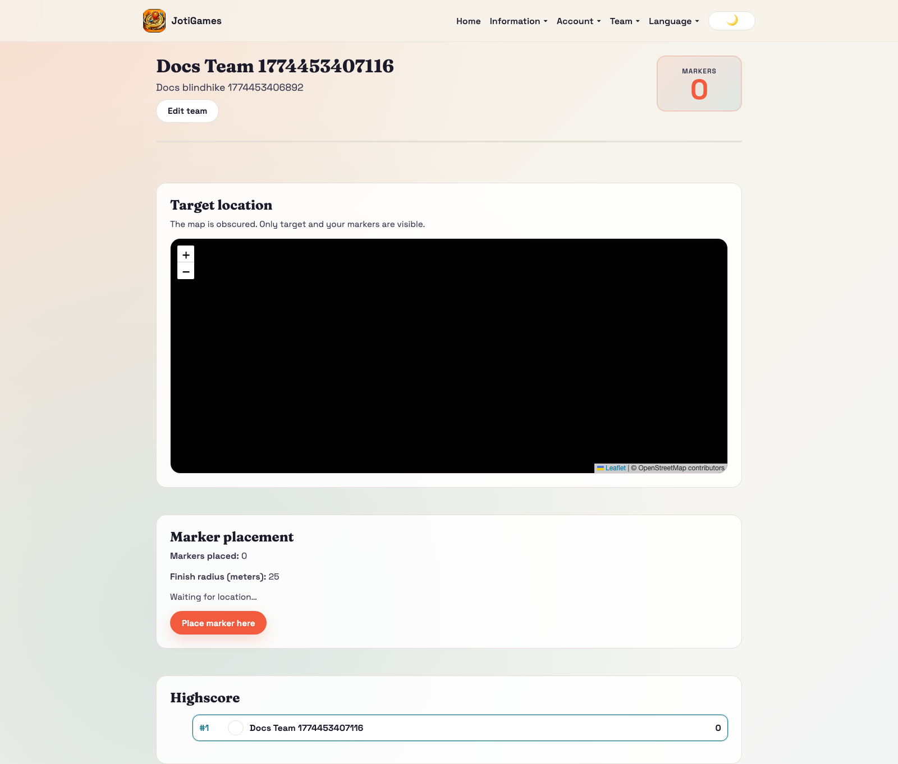
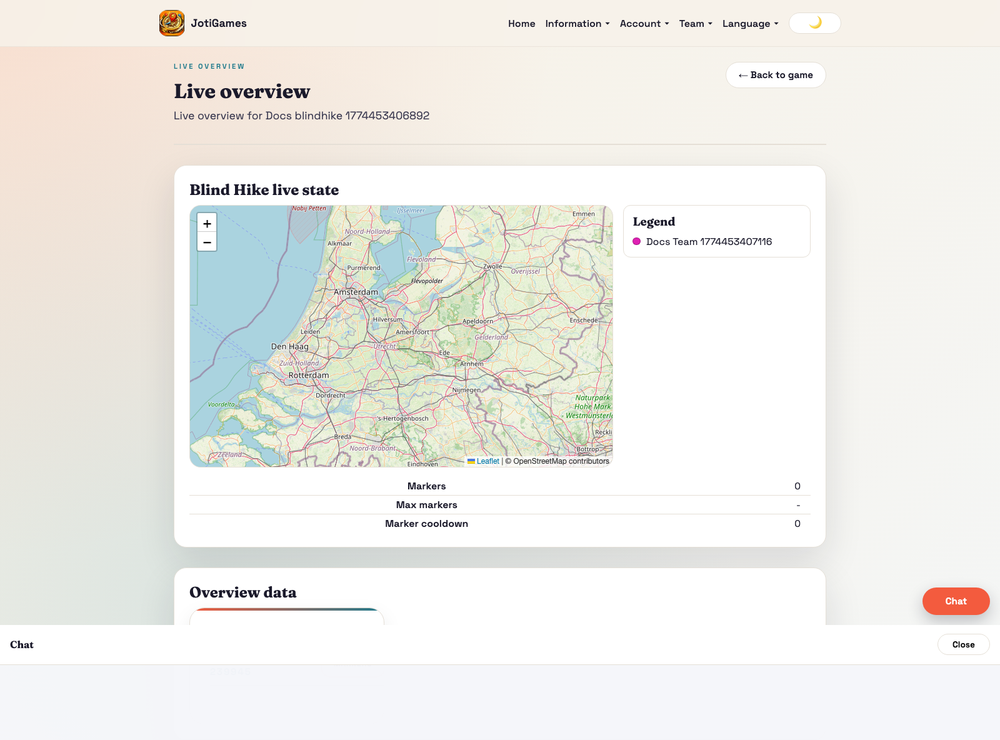

# Blind Hike

## Objective

Reach the target with the fewest markers.

## Core flow

1. Admin sets target and distortion constraints.
2. Team dashboard obscures map perception.
3. Teams place markers strategically.
4. Marker counts and finish state update live.

## Relevant pages

- Public info page: `/info/games/blind-hike`
- Admin configure: `/admin/blindhike/:gameId/configure`
- Admin live overview: `/admin/games/:gameId/live-overview`
- Team dashboard panel: `/team`

## Page descriptions

- Public info page: detailed landing/how-to-play page grounded in distorted map rules, finish radius pressure, and marker-efficiency scoring.
- Configure page: target, transforms, marker limits/cooldowns, finish radius.
- Team dashboard panel: marker placement and progress to finish.

## Screenshot

## Runtime screenshots

### Team dashboard (`/team`)

Shows distorted navigation and marker placement flow that teams use to reach the target.

### Admin live overview (`/admin/games/:gameId/live-overview`)

Shows marker distribution, finish progress, and team performance during play.

## Realtime highlights

- `team.blind_hike.marker.added`
- `admin.blind_hike.marker.added`
- `game.blind_hike.marker.added`
