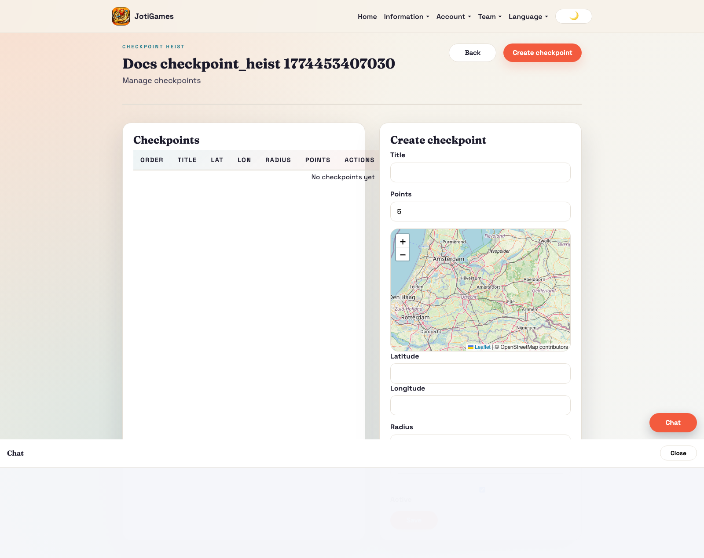
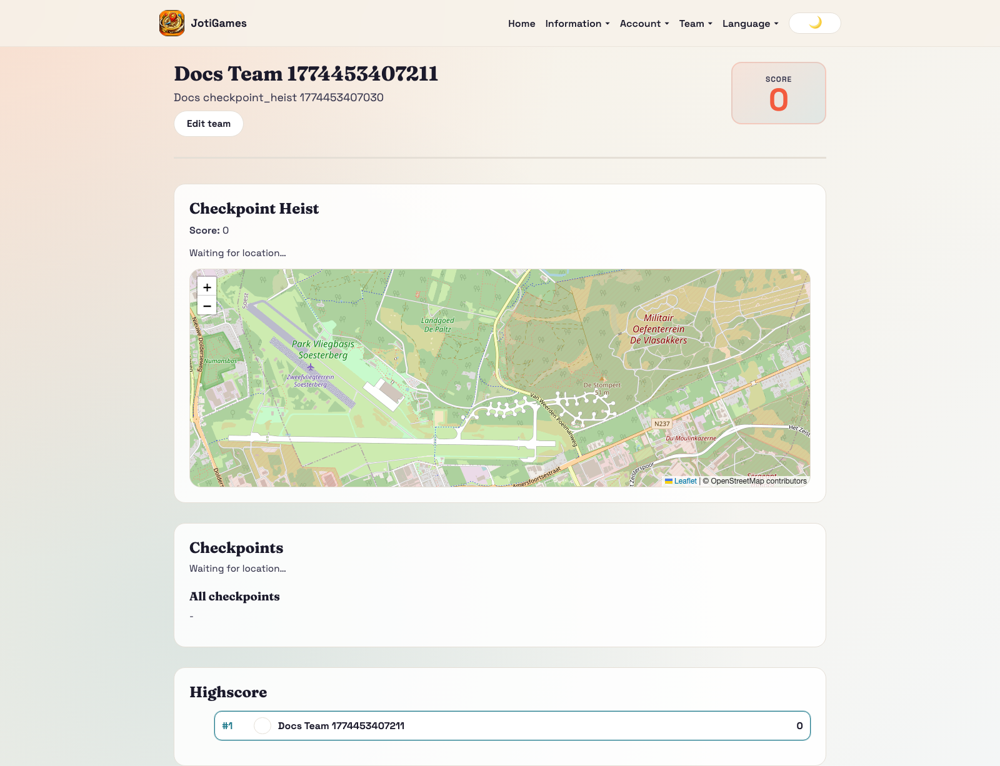
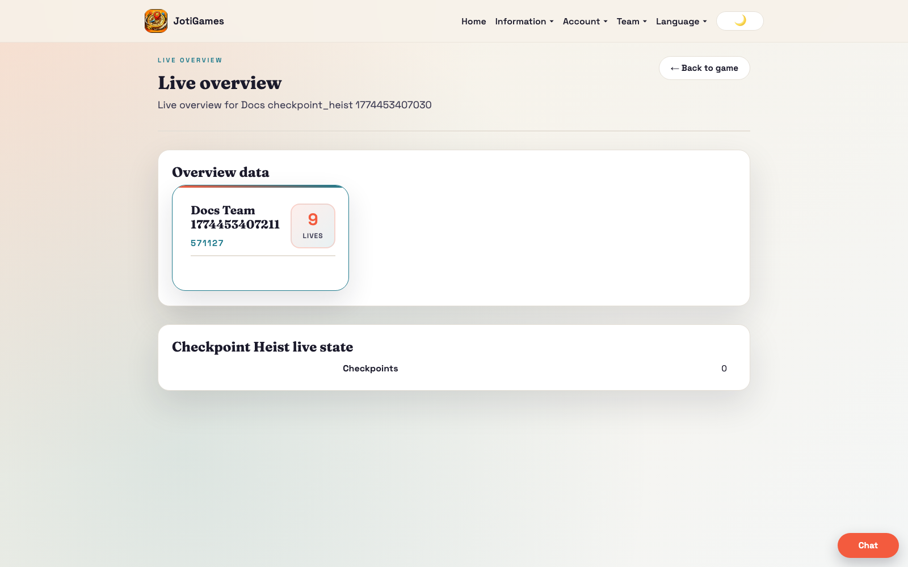

# Checkpoint Heist

## Objective

Progress ordered checkpoints and maximize checkpoint points.

## Core flow

1. Admin configures checkpoints and ordering.
2. Teams physically reach active checkpoints in order.
3. Reaching a checkpoint unlocks the next one.

## Relevant pages

- Admin checkpoints: `/admin/checkpoint-heist/:gameId/checkpoints`
- Admin live overview: `/admin/games/:gameId/live-overview`
- Team dashboard panel: `/team`

## Page descriptions

- Checkpoints page: define checkpoint geometry, points, and activation state.
- Team dashboard panel: active checkpoint progress and completion status.

## Team panel component

`frontend/src/pages/team/CheckpointHeistTeamPanel.jsx`

- Leaflet map with checkpoint circles (colour-coded by marker_color)
- GPS tracking with haversine proximity detection (radius_meters)
- Capture button appears when team is within range of an active checkpoint
- Checkpoint status table and leaderboard
- Props: `state`, `currentTeamId`, `t`, `onCaptureCheckpoint`, `capturing`

## Bootstrap data

Service override in `backend/app/services/checkpoint_heist_service.py` adds:
- `checkpoints[]` — id, title, lat, lon, radius_meters, points, marker_color, is_active
- `highscore[]` — team leaderboard rows

## Realtime highlights

- `team.checkpoint_heist.*` → triggers full state reload
- `game.checkpoint_heist.*` → triggers full state reload

## Screenshot

## Runtime screenshots

### Team dashboard (`/team`)

Shows current active checkpoint and ordered progression state per team.

### Admin live overview (`/admin/games/:gameId/live-overview`)

Shows checkpoint captures, team advancement, and live score context.

