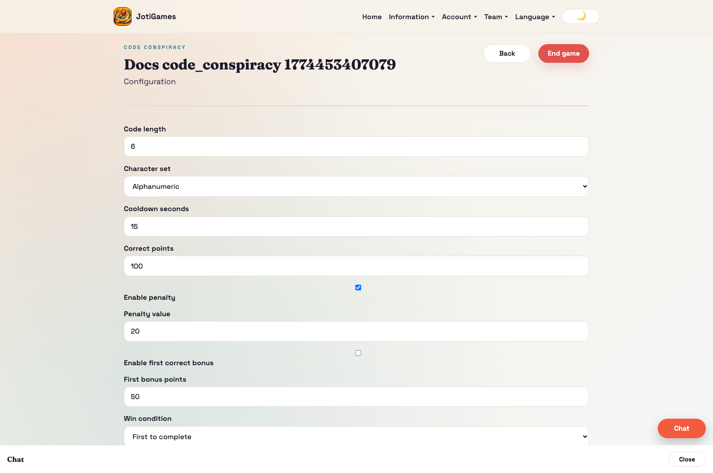
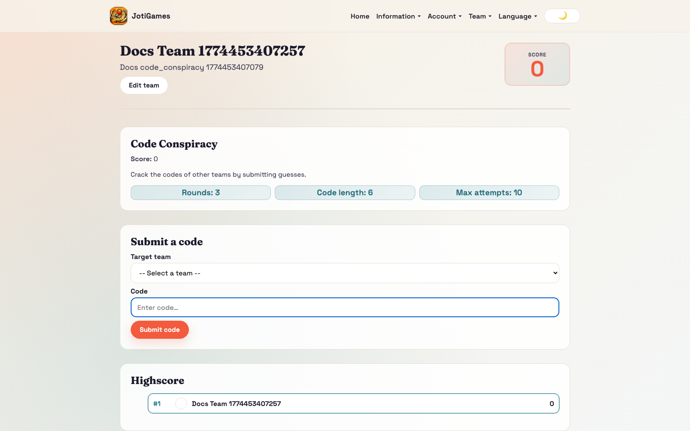
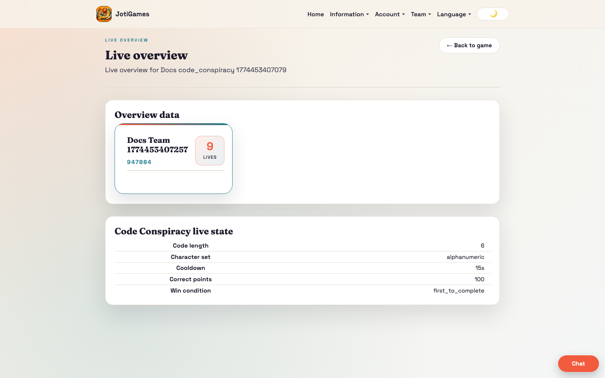

# Code Conspiracy

## Objective

Crack opponent codes first, or finish with the highest score.

## Core flow

1. Admin configures code format, points/penalties, cooldown, and win condition.
2. Team dashboard shows code and opponent guess rows.
3. Teams submit guesses against opponents.
4. Correct guesses lock progress and award points; incorrect guesses apply penalties.
5. Admin live overview receives submission and score updates.

## Relevant pages

- Public info page: `/info/games/code-conspiracy`
- Admin configure: `/admin/code-conspiracy/:gameId/configure`
- Admin live overview: `/admin/games/:gameId/live-overview`
- Team dashboard panel: `/team`

## Team panel component

`frontend/src/pages/team/CodeConspiracyTeamPanel.jsx`

- Target team dropdown selector (excludes own team)
- Code input field with configurable length
- Submission history table with timestamps
- No map — form-based UI
- Props: `state`, `currentTeamId`, `t`, `onSubmitCode`, `submitting`

## Bootstrap data

Service override in `backend/app/services/code_conspiracy_service.py` adds:
- `config` — rounds, code_length, max_attempts
- `teams_list[]` — other teams available as targets
- `highscore[]` — team leaderboard rows

## Realtime highlights

- `team.code_conspiracy.*` → triggers full state reload
- `game.code_conspiracy.*` → triggers full state reload

## Page descriptions

- Public info page: detailed landing/how-to-play page grounded in target-team code attacks, configurable code length, attempt limits, and penalty-driven score pressure.
- Configure page: code length/charset, cooldown, points, penalties, win mode.
- Team dashboard panel: guess submission and outcome tracking.

## Screenshot

## Runtime screenshots

### Team dashboard (`/team`)

Shows code-guess interactions, target feedback, and team-side scoring effects.

### Admin live overview (`/admin/games/:gameId/live-overview`)

Shows live submission flow and relative code-cracking progress between teams.

