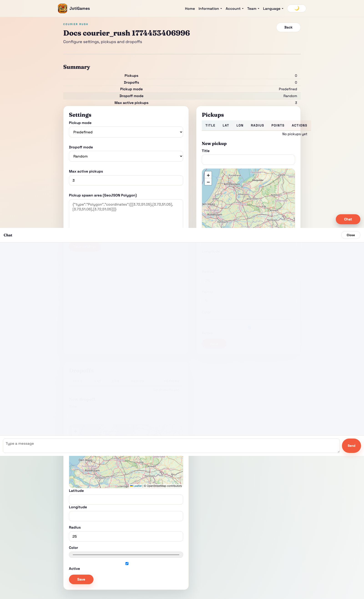
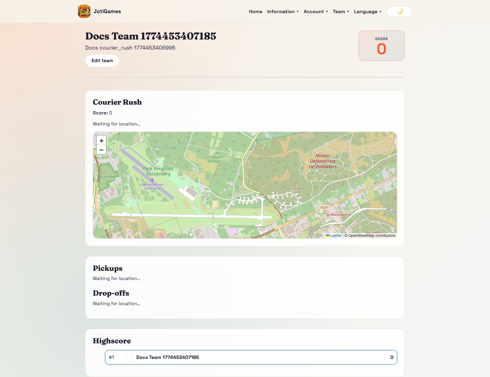
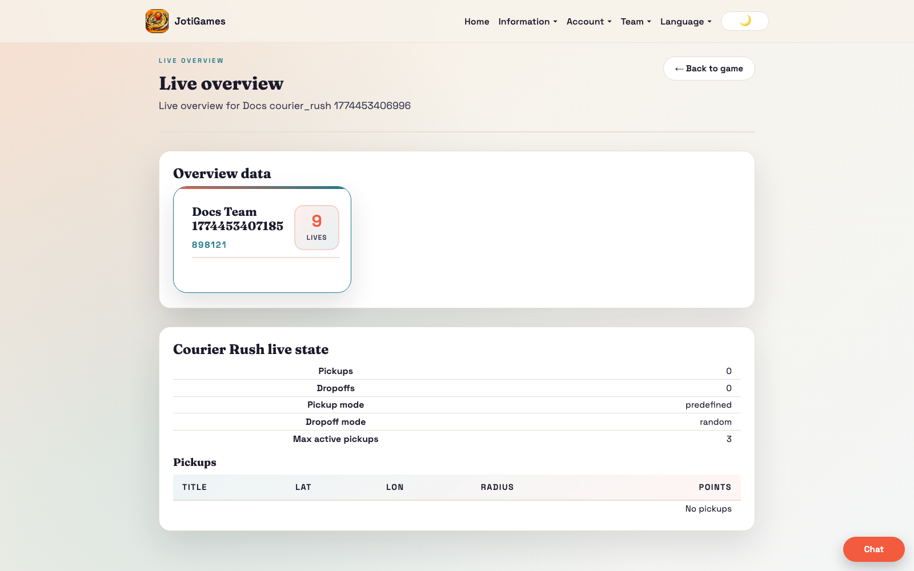

# Courier Rush

## Objective

Optimize pickup/dropoff logistics to maximize score.

## Core flow

1. Admin configures pickup/dropoff behavior and routing mode.
2. Teams move to pickups and complete deliveries.
3. Routing efficiency determines score outcomes.

## Relevant pages

- Admin configure: `/admin/courier-rush/:gameId/configure`
- Admin live overview: `/admin/games/:gameId/live-overview`
- Team dashboard panel: `/team`

## Team panel component

`frontend/src/pages/team/CourierRushTeamPanel.jsx`

- Leaflet map with pickup markers (blue) and dropoff markers (green)
- GPS tracking with haversine proximity detection
- Separate Confirm Pickup and Confirm Dropoff buttons when in range
- Uses `actionPathOverride` for dropoff endpoint (`dropoff/confirm`)
- Props: `state`, `currentTeamId`, `t`, `onConfirmPickup`, `onConfirmDropoff`, `confirmingPickup`, `confirmingDropoff`

## Bootstrap data

Service override in `backend/app/services/courier_rush_service.py` adds:
- `pickups[]` — id, title, lat, lon, radius_meters, points, marker_color, is_active
- `dropoffs[]` — id, title, lat, lon, radius_meters, points, marker_color, is_active
- `highscore[]` — team leaderboard rows

## API endpoints (team actions)

- `POST /{game_id}/teams/{team_id}/pickup/confirm` — default action path
- `POST /{game_id}/teams/{team_id}/dropoff/confirm` — uses actionPathOverride

## Realtime highlights

- `team.courier_rush.*` → triggers full state reload
- `game.courier_rush.*` → triggers full state reload

## Page descriptions

- Configure page: pickup mode, dropoff mode, active pickup constraints, and location entities.
- Team dashboard panel: mission state and delivery actions.

## Screenshot

## Runtime screenshots

### Team dashboard (`/team`)

Shows pickup/dropoff mission state and delivery actions in the active route context.

### Admin live overview (`/admin/games/:gameId/live-overview`)

Shows logistics flow, team mission throughput, and score impact during runtime.

