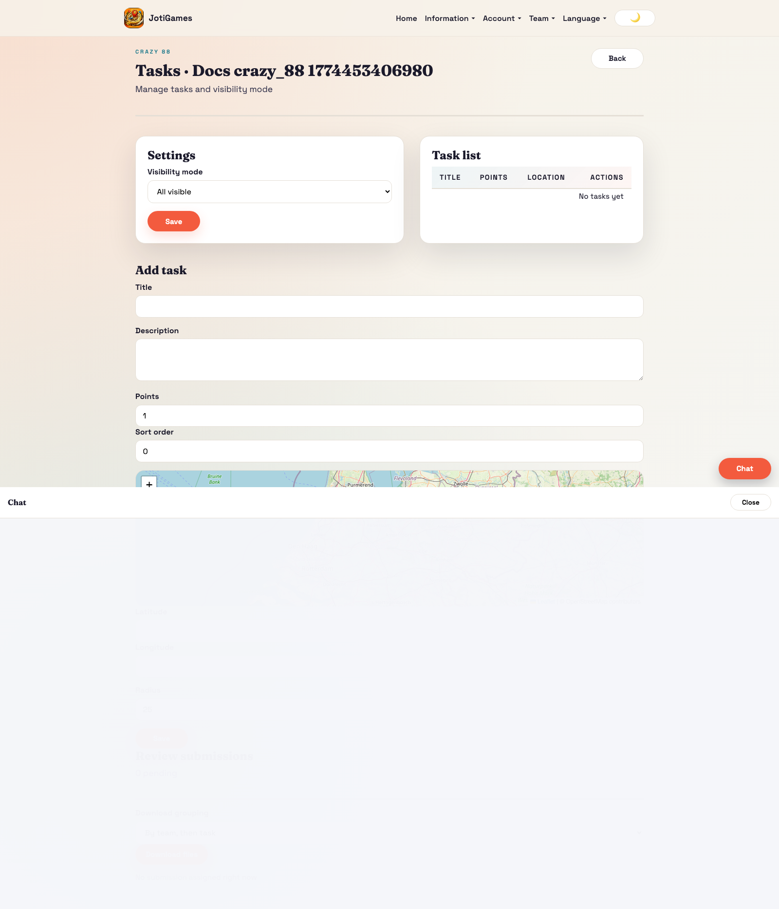
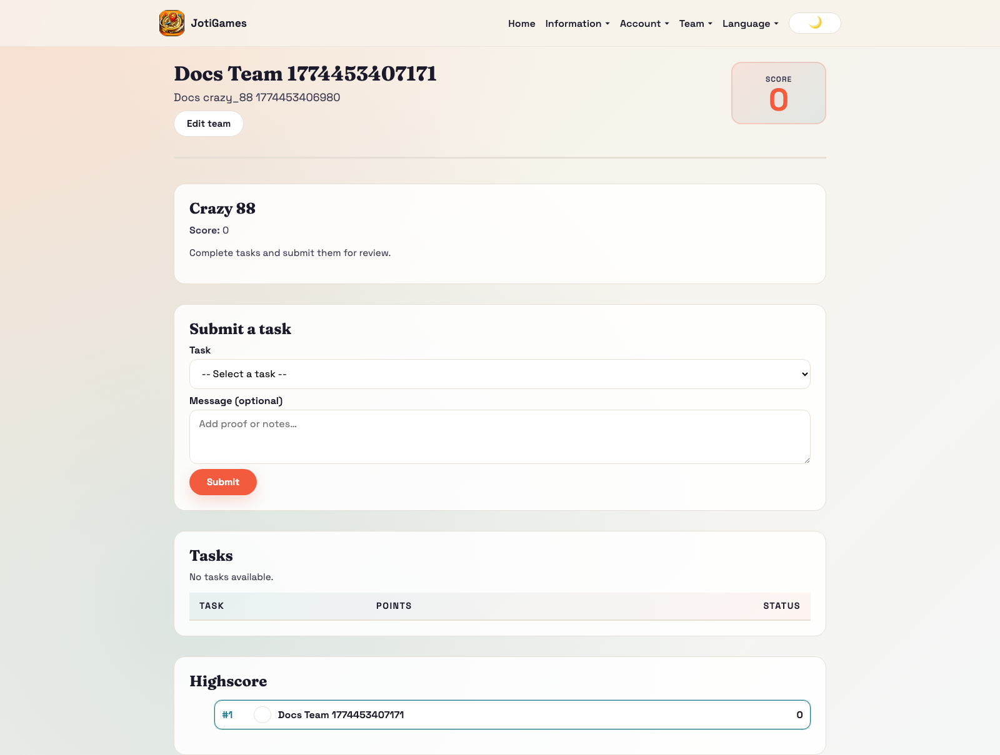
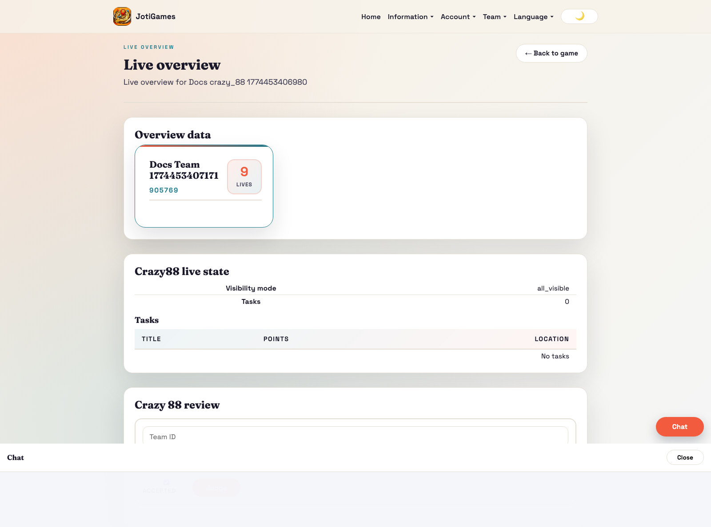

# Crazy 88

## Objective

Score the most points via approved task submissions.

## Core flow

1. Admin configures visibility mode and task catalog.
2. Teams submit proof for tasks (text/photo/video).
3. Admin reviews and approves/rejects submissions.
4. Approved submissions grant points.

## Relevant pages

- Admin tasks: `/admin/crazy88/:gameId/tasks`
- Admin live overview: `/admin/games/:gameId/live-overview`
- Team dashboard panel: `/team`

## Team panel component

`frontend/src/pages/team/Crazy88TeamPanel.jsx`

- Task selector dropdown with category filtering
- Message textarea for submission details
- Task list with status badges (⏳ pending / ✅ approved / ❌ rejected)
- No map — form-based UI
- Props: `state`, `currentTeamId`, `t`, `onSubmitTask`, `submitting`

## Bootstrap data

Service override in `backend/app/services/crazy88_service.py` adds:
- `tasks[]` — id, title, description, points, category, is_active
- `highscore[]` — team leaderboard rows

## Realtime highlights

- `team.crazy_88.*` → triggers full state reload
- `game.crazy_88.*` → triggers full state reload

## Page descriptions

- Tasks page: configure visibility mode, task list, and review queues.
- Team dashboard panel: task execution and submission status.

## Screenshot

## Runtime screenshots

### Team dashboard (`/team`)

Shows task execution/submission state and team-facing approval progress.

### Admin live overview (`/admin/games/:gameId/live-overview`)

Shows submission intake, review pressure, and team score movement.

