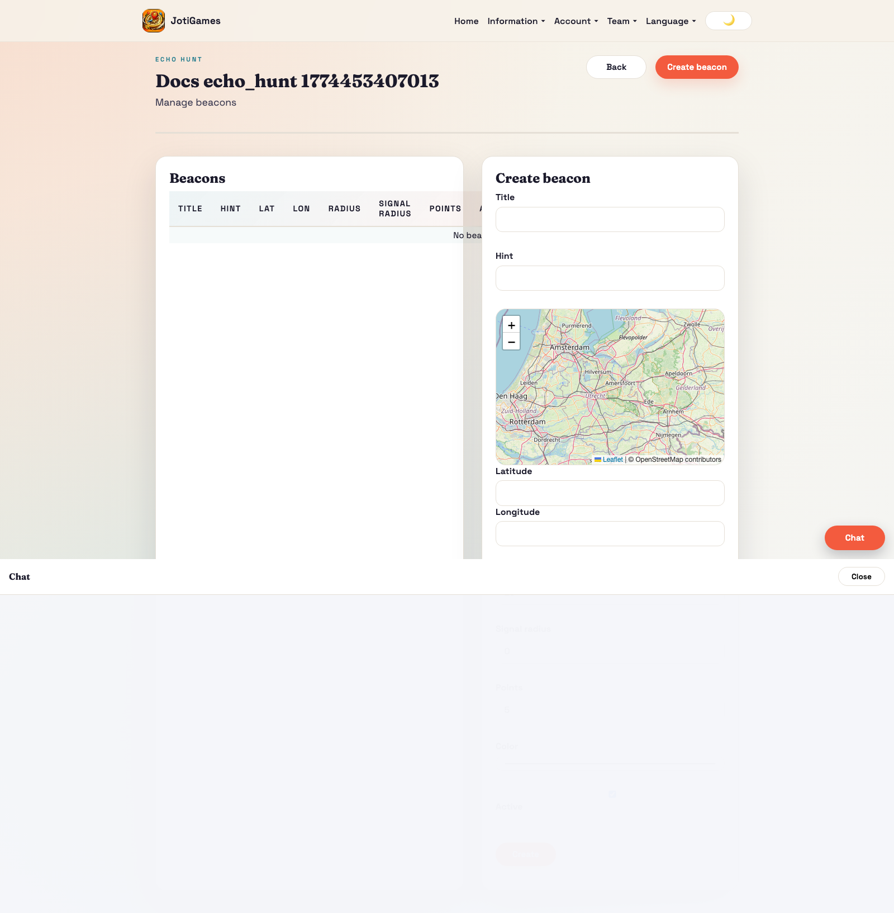
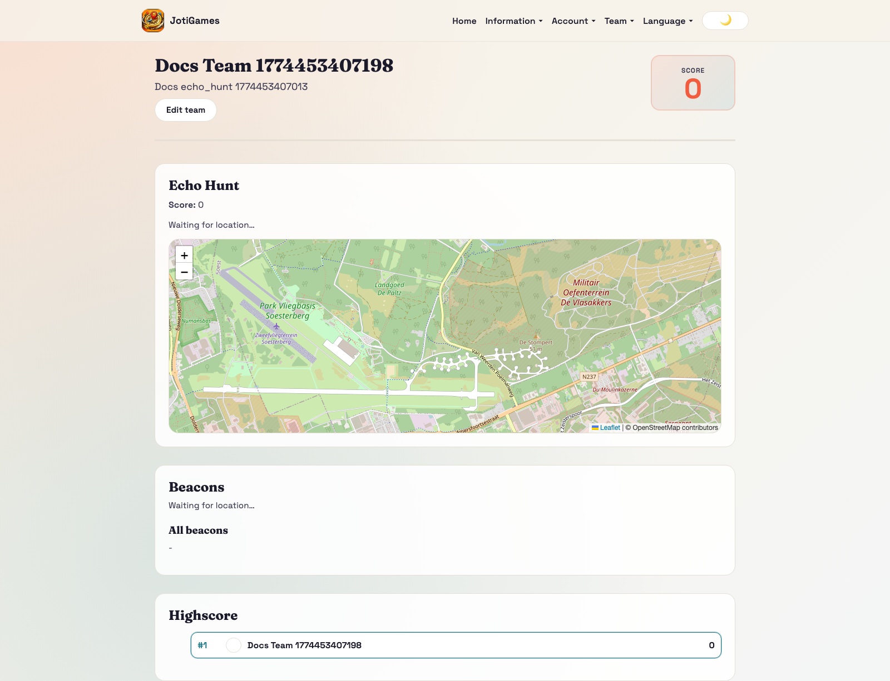
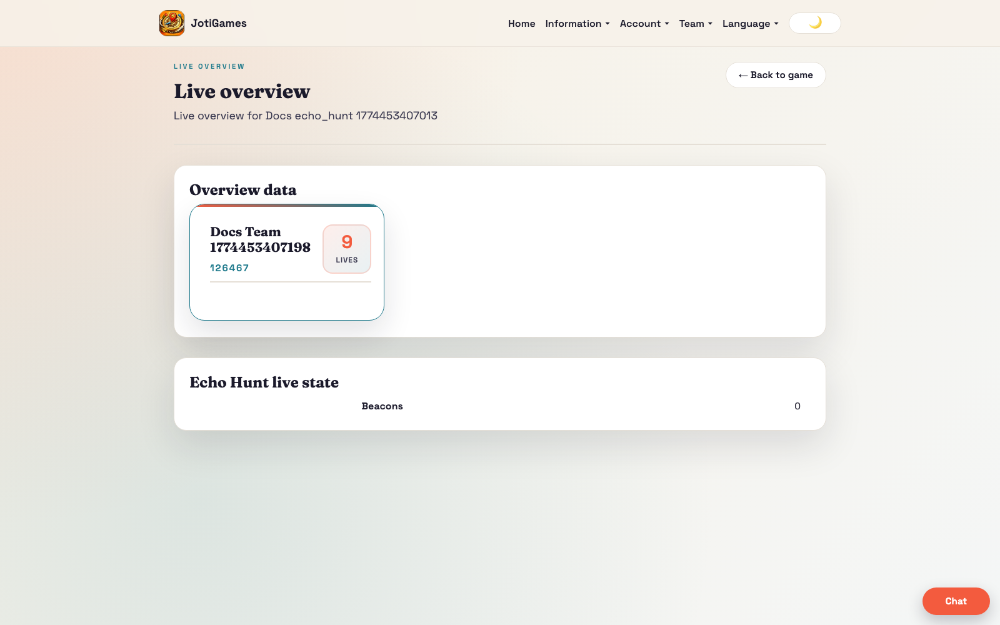

# Echo Hunt

## Objective

Discover and claim hidden beacons for points.

## Core flow

1. Admin configures beacon locations and detection logic.
2. Teams move and use signal feedback.
3. Teams claim beacons when discoverable.

## Relevant pages

- Admin beacons: `/admin/echo-hunt/:gameId/beacons`
- Admin live overview: `/admin/games/:gameId/live-overview`
- Team dashboard panel: `/team`

## Team panel component

`frontend/src/pages/team/EchoHuntTeamPanel.jsx`

- Leaflet map with beacon circles (colour-coded)
- GPS tracking with haversine proximity detection
- Claim button appears when team is within range of an active beacon
- Beacon status table and leaderboard
- Props: `state`, `currentTeamId`, `t`, `onClaimBeacon`, `claiming`

## Bootstrap data

Service override in `backend/app/services/echo_hunt_service.py` adds:
- `beacons[]` — id, title, lat, lon, radius_meters, points, marker_color, is_active
- `highscore[]` — team leaderboard rows

## Realtime highlights

- `team.echo_hunt.*` → triggers full state reload
- `game.echo_hunt.*` → triggers full state reload

## Page descriptions

- Beacons page: CRUD for beacons, detection radius, points, and hints.
- Team dashboard panel: proximity, discovery, and claim feedback.

## Screenshot

## Runtime screenshots

### Team dashboard (`/team`)

Shows proximity cues, beacon discovery state, and claim interactions.

### Admin live overview (`/admin/games/:gameId/live-overview`)

Shows beacon control state and team momentum during active rounds.

