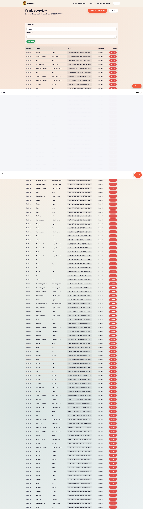
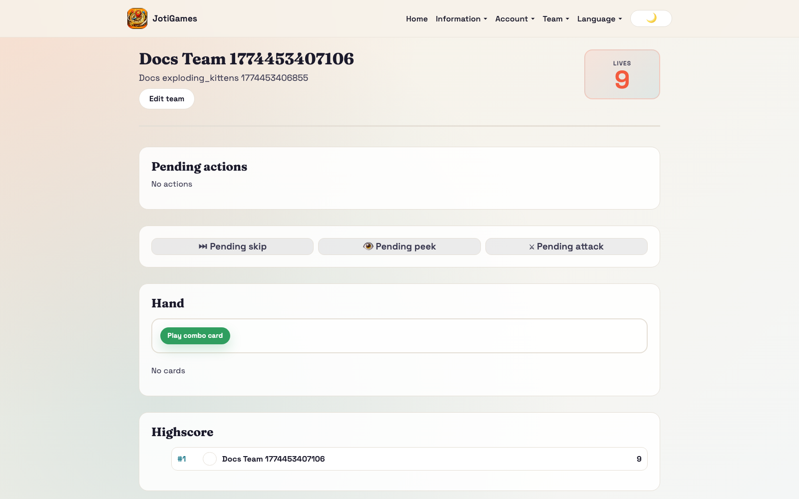
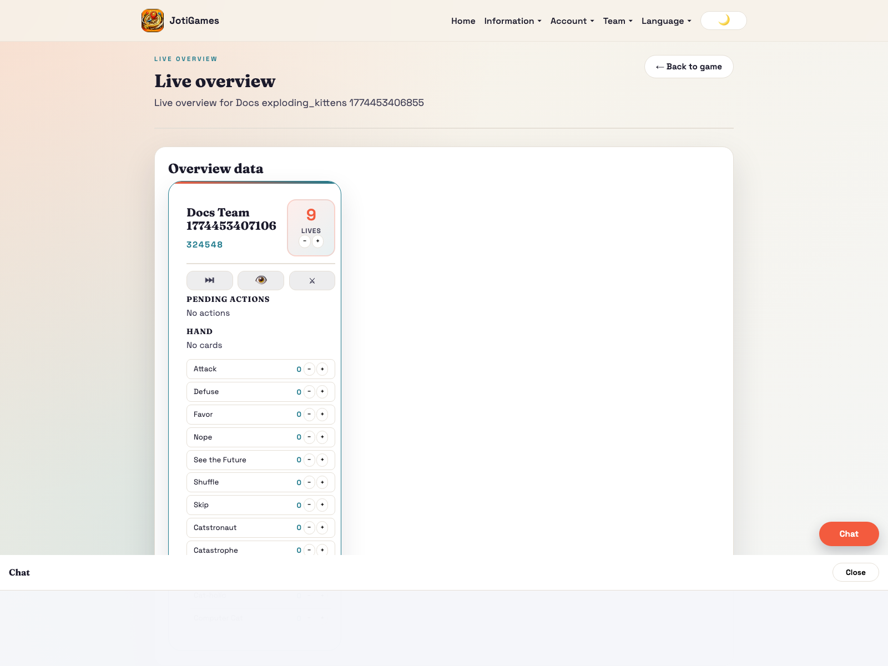

# Exploding Kittens

## Objective

End with the most lives.

## Core flow

1. Teams scan and resolve card effects.
2. Teams play hand cards and combos.
3. Targeted actions are accepted/nope-resolved.
4. Lives and highscore update in realtime.

## Relevant pages

- Admin cards: `/admin/games/:gameId/cards`
- Admin card PDF tools: `/admin/games/:gameId/cards/pdf`
- Admin live overview: `/admin/games/:gameId/live-overview`
- Team dashboard panel: `/team`
- Team scan flow: `/team/scan/:qrToken`

## Page descriptions

- Cards page: manage card pools and card operations per game.
- Card PDF tools page: export/print card assets for physical play.
- Team dashboard panel: card hand, pending actions, combo handling.

## Screenshot

## Runtime screenshots

### Team dashboard (`/team`)

Shows hand state, pending actions, combo usage, and life-pressure decisions.

### Admin live overview (`/admin/games/:gameId/live-overview`)

Shows live action queue pressure, team state changes, and score/life movement.

## Realtime highlights

- card add/remove events
- action add/remove events
- lives/highscore updates
