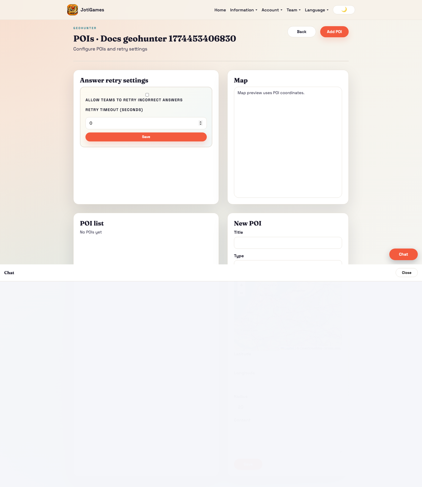
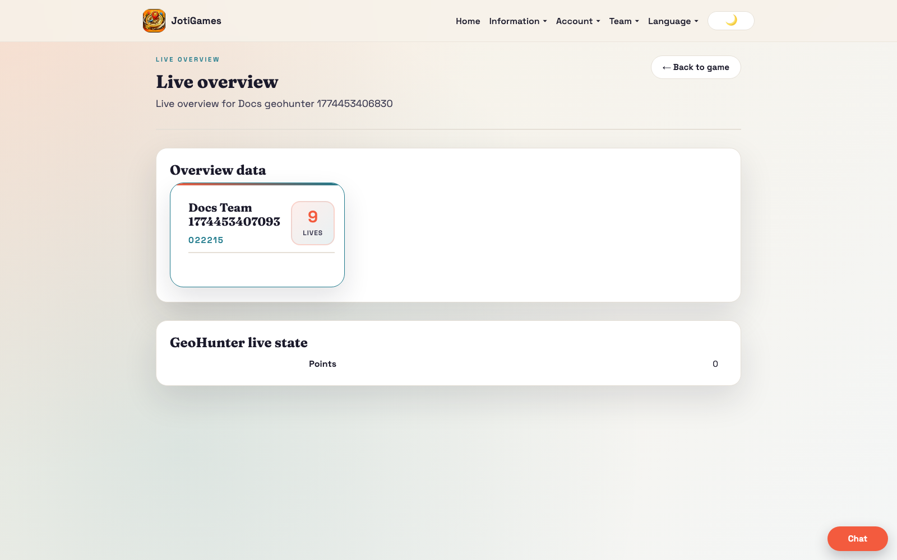

# GeoHunter

## Objective

Achieve the highest correct-answer score by game end.

## Core flow

1. Admin configures POIs with points, radius, and type (`text`, `multiple_choice`, `open_answer`).
2. Teams move into POI range.
3. Team modal adapts by type:
	- `text`: informational content only (no answer input)
	- `multiple_choice`: single-select bordered row list with selected background highlight
	- `open_answer`: free-text answer input
4. Correct graded answers increase score.
5. Team answer feedback is explicit:
	- correct answer: success message + updated score
	- incorrect answer: error message
	- retry timeout active: message with remaining wait time in seconds and backend lock per question per team
6. Team submissions are accepted only when the team is within the POI radius.
7. POI map visibility mode is configurable per game:
	- `all_visible`: all POIs remain visible on team map
	- `in_range_only`: POIs are visible only while team is in range; team location updates drive visibility refresh

## Submission + lock contract

- `geo_submission` is the authoritative source for GeoHunter attempts and retry locks.
- Server answer flow order:
	1. Resolve latest `geo_submission` row for `(team_id, point_id)`.
	2. If previous submission is correct, reject as already answered.
	3. If previous submission is incorrect and `submitted_at + retry_timeout_seconds` is still in the future, return active lock with remaining seconds.
	4. Only when unlocked, evaluate answer correctness.
	5. Persist submission (insert/update) with new `submitted_at`, correctness, answer payload, and awarded points.
- This keeps lock behavior stable across refreshes and devices without frontend-only timers.

## Relevant pages

- Public info page: `/info/games/geohunter`
- Admin POIs: `/admin/geohunter/:gameId/pois`
- Admin live overview: `/admin/games/:gameId/live-overview`
- Team dashboard panel: `/team`

## Team panel component

`frontend/src/pages/team/GeoHunterTeamPanel.jsx`

- Leaflet map with POI markers
- GPS tracking with haversine proximity detection and 10-second location updates
- Team dashboard enforces a defensive client throttle so location publishes can never exceed one request per 10 seconds, even during rapid UI re-renders
- Question modal rendering by POI type (`text` / `multiple_choice` / `open_answer`)
- Server-side answer validation (no client-side correctness checks)
- Team answer API now returns `correct`, `score`, and `retry_available_in_seconds` for direct user feedback
- Team answer API also returns `lock_active` so frontend can distinguish active lockout vs freshly incorrect answer
- Supports retry with configurable timeout
- Team location update responses include per-POI lock countdowns for currently in-range POIs so dashboard buttons/countdowns stay synced to backend state
- In-range POIs are rendered as dedicated cards in the team panel (title, points, status, and action)
- The separate “All locations” table is removed from team dashboard flow to keep focus on in-range interactions
- POIs already answered correctly by the current team stay visible in-range with a success label and disabled answer button, so teams can see completion state without re-submitting
- Props: `state`, `currentTeamId`, `t`, `onAnswerQuestion`, `onLocationUpdate`, `answering`

## Bootstrap data

Service override in `backend/app/services/geohunter_service.py` adds:
- `pois[]` — id, title, lat, lon, radius_meters, points, marker_color, is_active, question_type, question_text, content, choices[]
- `retry_enabled` — whether retries are allowed
- `retry_timeout_seconds` — cooldown between retries
- `poi_visibility_mode` — `all_visible` or `in_range_only` map visibility behavior for team dashboard
- `retry_available_in_seconds` — max remaining lock time across currently locked questions for the team
- `retry_locked_poi_seconds` — per-question lock map (`poi_id -> remaining seconds`) derived from `geo_submission`
- `nearby_poi_ids` — POIs currently in range on load
- `nearby_poi_lockouts_seconds` — per-nearby-POI lock map for immediate dashboard rendering
- `highscore[]` — team leaderboard rows

## Realtime highlights

- `team.geohunter.*` → triggers full state reload
- `game.geohunter.*` → triggers full state reload
- `team.geohunter.nearby.updated` payload includes current in-range POI ids per location update so team UI can render visibility mode `in_range_only` correctly

## Page descriptions

- Public info page: detailed landing/how-to-play page grounded in POI-based navigation, open and multiple-choice questions, and retry-aware validation.
- POIs page: create/edit POIs, answer format, retry behavior.
- Team dashboard panel: proximity and answer interactions.

## Screenshot

## Runtime screenshots

### Team dashboard (`/team`)

Shows in-range POI question flow, answer submission, and immediate scoring context.

### Admin live overview (`/admin/games/:gameId/live-overview`)

Shows POI activity, answer throughput, and leaderboard movement.

