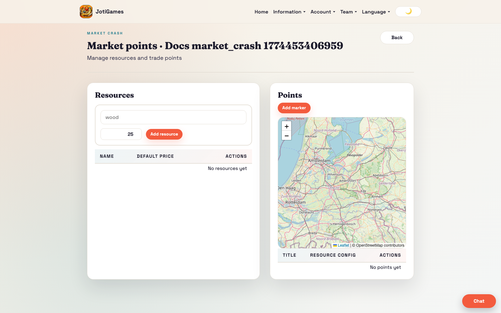
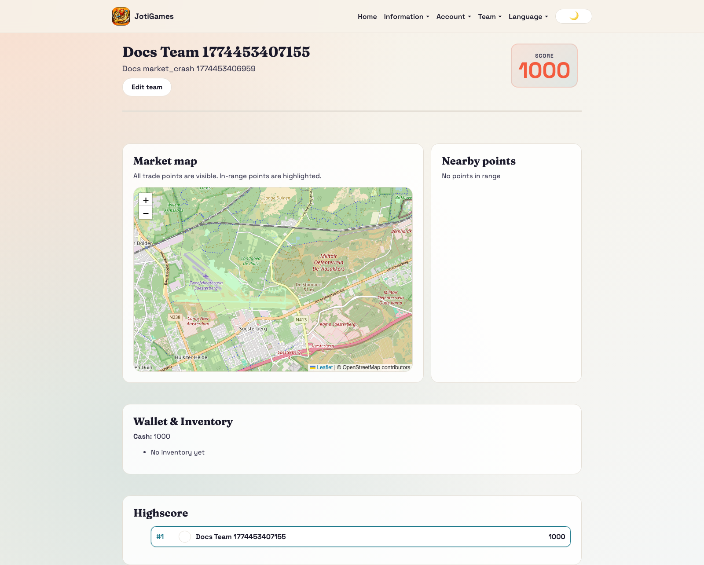
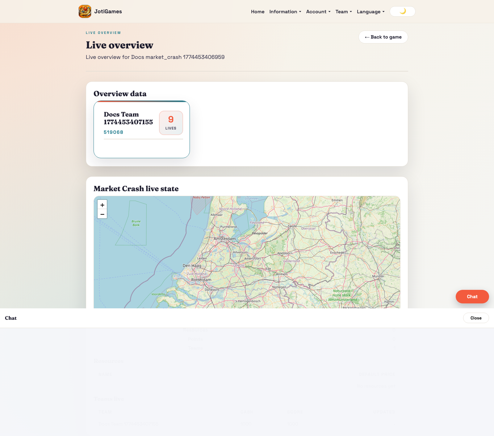

# Market Crash

## Objective

Maximize profit and cash by trading resources at market points.

## Core flow

1. Admin defines resources and trade points with buy/sell settings.
2. Team dashboard map shows points and in-range trading options.
3. Teams buy/sell resources to optimize inventory and cash.
4. Worker fluctuates prices; price deltas are pushed realtime.

## Relevant pages

- Public info page: `/info/games/market-crash`
- Admin points overview: `/admin/market-crash/:gameId/points`
- Admin point create: `/admin/market-crash/:gameId/points/new`
- Admin point edit: `/admin/market-crash/:gameId/points/:pointId/edit`
- Admin live overview: `/admin/games/:gameId/live-overview`
- Team dashboard panel: `/team`

## Page descriptions

- Public info page: detailed landing/how-to-play page grounded in live price ticks, buy/sell timing, inventory pressure, and cash management.
- Points overview page: resources table, point list, and map-based point management.
- Point form pages: create/edit per-point resource buy/sell settings.
- Team dashboard panel: nearby points, inventory, cash, trade actions.

## Screenshot

## Runtime screenshots

### Team dashboard (`/team`)

Shows nearby trade points, buy/sell actions, inventory, and live cash/score effects.

### Admin live overview (`/admin/games/:gameId/live-overview`)

Shows team locations, trade velocity, and market-wide score movement.

## Realtime highlights

- team self updates
- nearby point updates
- admin team location and trade events
- game/admin/team price delta events

## Operational dependency

- `backend/scripts/market_crash_fluctuate_prices.py`
