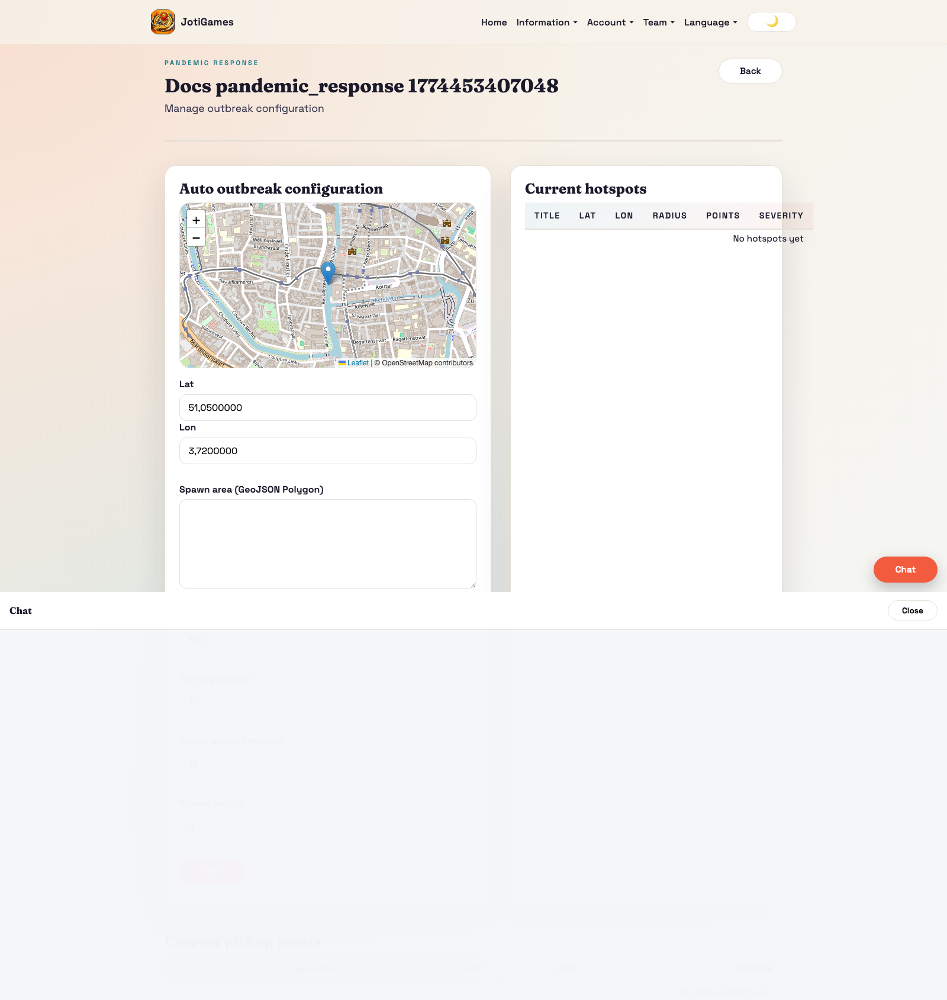
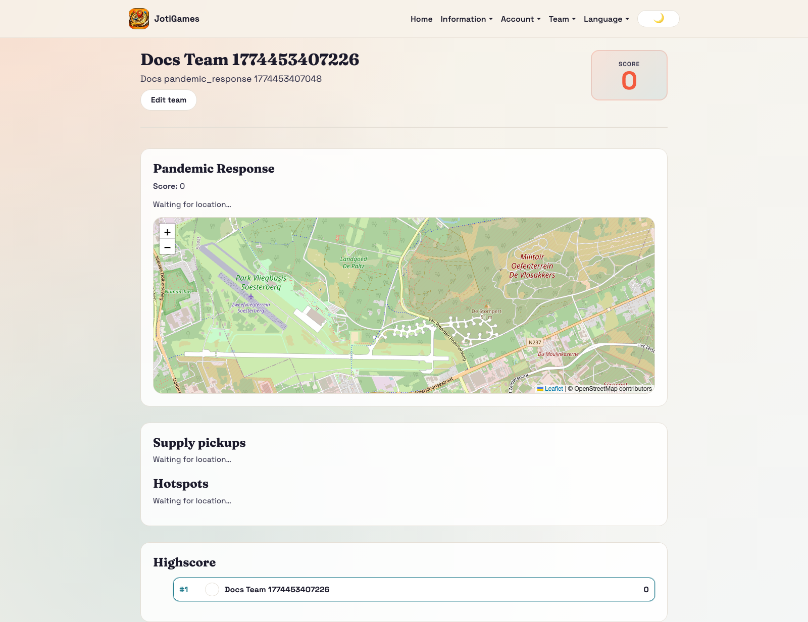
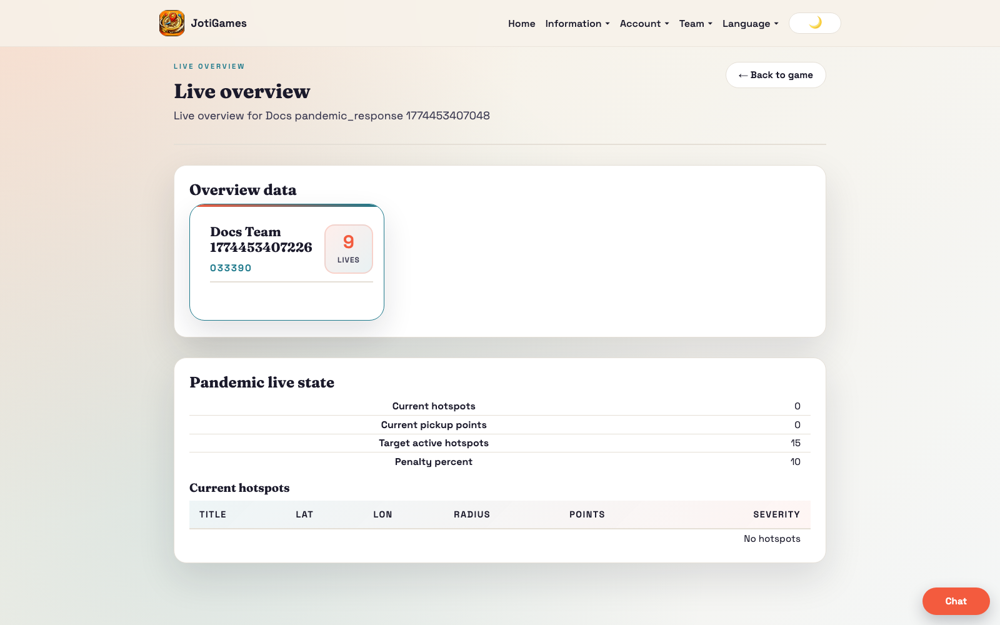

# Pandemic Response

## Objective

Achieve the highest response score by resolving hotspots.

## Core flow

1. Admin configures hotspot and severity model settings.
2. Teams enter hotspot areas to resolve incidents.
3. Response scoring and penalties are applied by config.

## Relevant pages

- Admin hotspots/config: `/admin/pandemic-response/:gameId/hotspots`
- Admin live overview: `/admin/games/:gameId/live-overview`
- Team dashboard panel: `/team`

## Team panel component

`frontend/src/pages/team/PandemicResponseTeamPanel.jsx`

- Leaflet map with hotspot circles (red, sized by severity) and pickup circles (blue)
- GPS tracking with haversine proximity detection
- Collect button for pickups, Resolve button for hotspots when in range
- Uses `actionPathOverride` for hotspot endpoint (`hotspot/resolve`)
- Props: `state`, `currentTeamId`, `t`, `onCollectPickup`, `onResolveHotspot`, `collectingPickup`, `resolvingHotspot`

## Bootstrap data

Service override in `backend/app/services/pandemic_response_service.py` adds:
- `hotspots[]` — id, title, lat, lon, radius_meters, points, marker_color, is_active, severity
- `pickups[]` — id, title, lat, lon, radius_meters, points, marker_color, is_active
- `highscore[]` — team leaderboard rows

## API endpoints (team actions)

- `POST /{game_id}/teams/{team_id}/pickup/collect` — default action path
- `POST /{game_id}/teams/{team_id}/hotspot/resolve` — uses actionPathOverride

## Realtime highlights

- `team.pandemic_response.*` → triggers full state reload
- `game.pandemic_response.*` → triggers full state reload

## Page descriptions

- Hotspots/config page: center/spawn rules, severity timing, penalties, and pickup count.
- Team dashboard panel: hotspot resolution feedback and team score effects.

## Screenshot

## Runtime screenshots

### Team dashboard (`/team`)

Shows hotspot response flow, pickup interactions, and penalty/reward feedback.

### Admin live overview (`/admin/games/:gameId/live-overview`)

Shows hotspot lifecycle, team response effectiveness, and live scoreboard impact.

