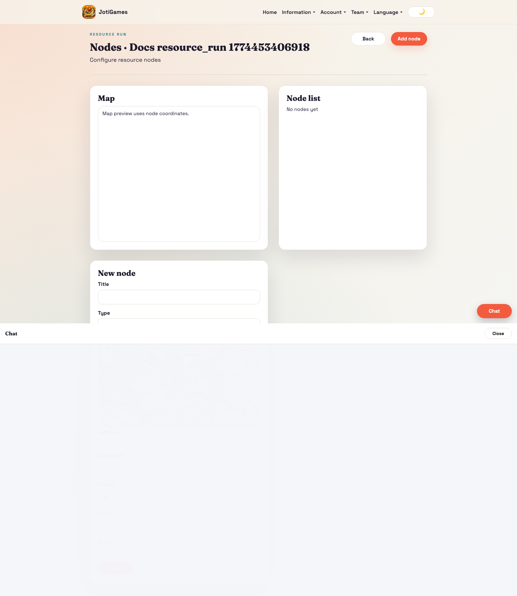
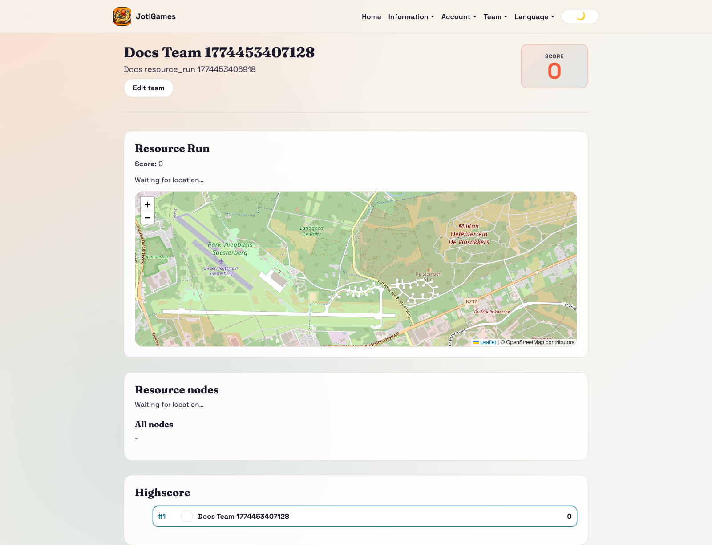
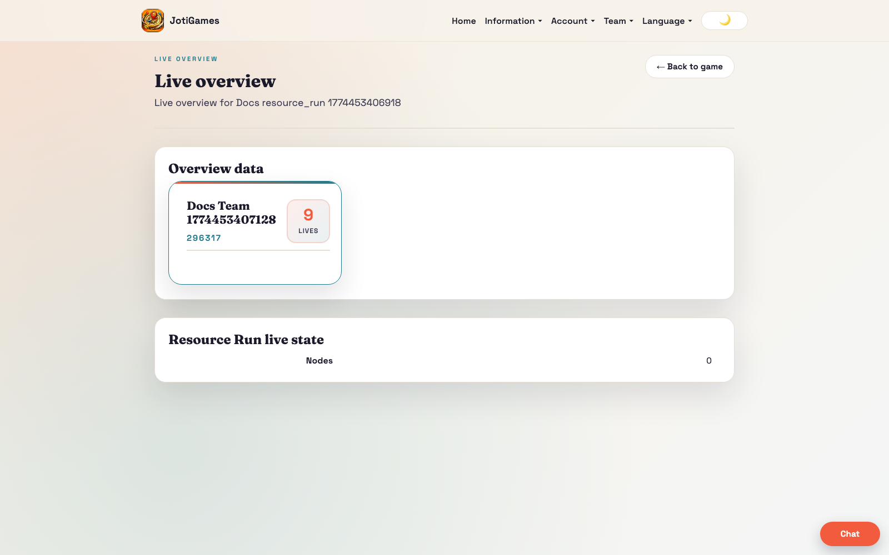

# Resource Run

## Objective

Collect resources and maximize score.

## Core flow

1. Admin configures resource nodes.
2. Teams move into node radius and claim resources.
3. Claims convert to score.

## Relevant pages

- Admin nodes: `/admin/resource-run/:gameId/nodes`
- Admin live overview: `/admin/games/:gameId/live-overview`
- Team dashboard panel: `/team`

## Team panel component

`frontend/src/pages/team/ResourceRunTeamPanel.jsx`

- Leaflet map with resource node circles (colour-coded)
- GPS tracking with haversine proximity detection
- Claim button appears when team is within range of an active node
- Node status table and leaderboard
- Props: `state`, `currentTeamId`, `t`, `onClaimResource`, `claiming`

## Bootstrap data

Service override in `backend/app/services/resource_run_service.py` adds:
- `nodes[]` — id, title, lat, lon, radius_meters, points, marker_color, is_active
- `highscore[]` — team leaderboard rows

## Realtime highlights

- `team.resource_run.*` → triggers full state reload
- `game.resource_run.*` → triggers full state reload

## Page descriptions

- Nodes page: CRUD for resource nodes (type, radius, points).
- Team dashboard panel: node interaction state and score progression.

## Screenshot

## Runtime screenshots

### Team dashboard (`/team`)

Shows node proximity state, claim actions, and score progression.

### Admin live overview (`/admin/games/:gameId/live-overview`)

Shows node interaction traffic and team scoring momentum in realtime.

