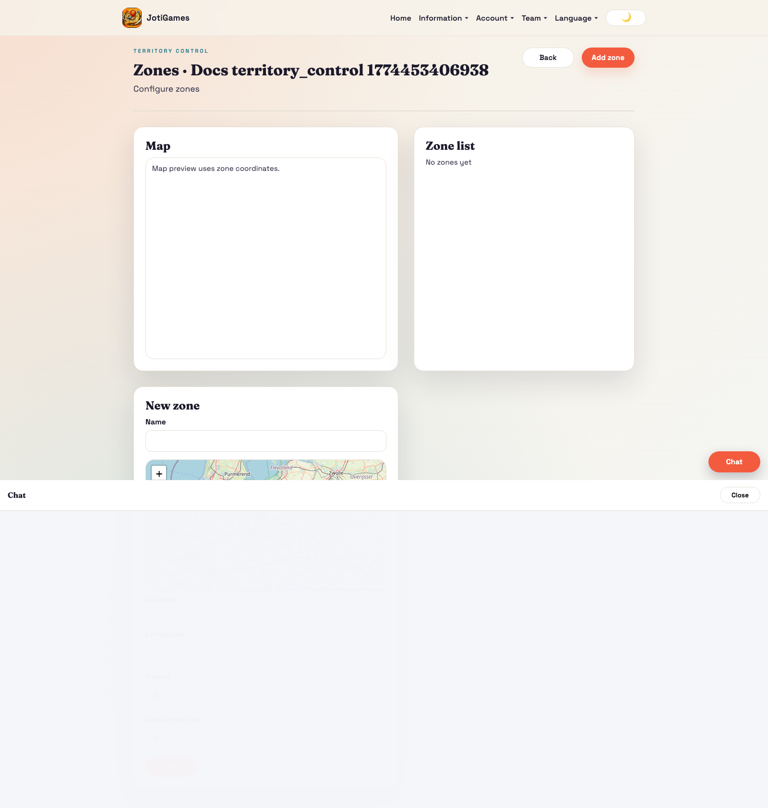
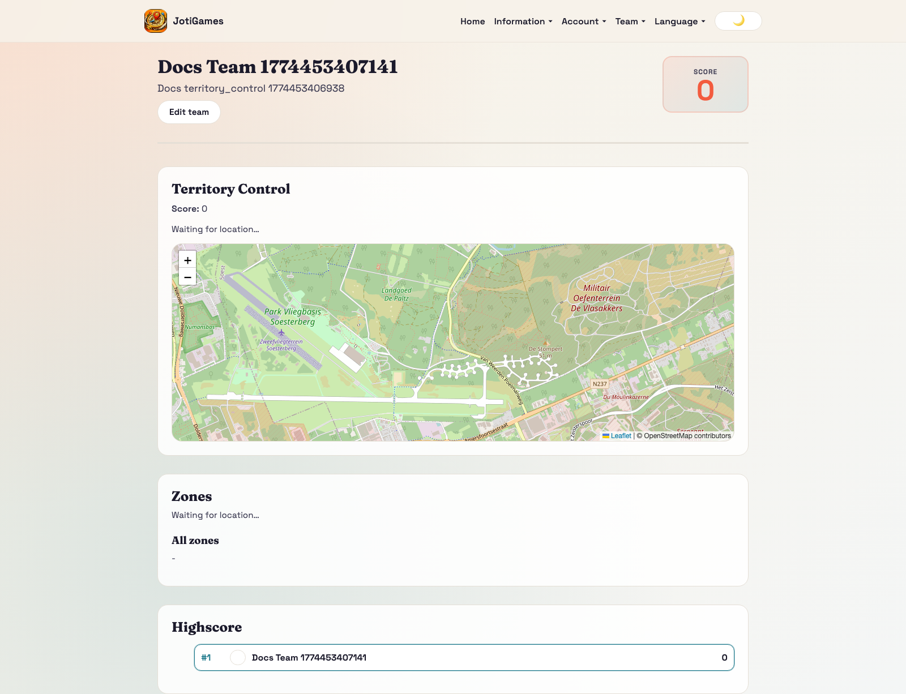
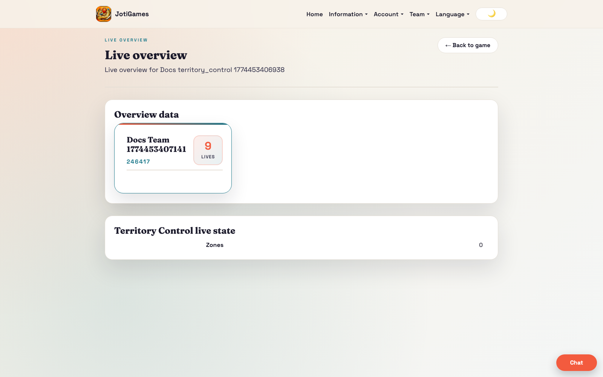

# Territory Control

## Objective

Maximize score through capture and hold ticks.

## Core flow

1. Admin configures zones and capture values.
2. Teams capture zones for immediate points.
3. Backend worker awards recurring hold points for owned active zones on each tick.

## Relevant pages

- Public info page: `/info/games/territory-control`
- Admin zones: `/admin/territory-control/:gameId/zones`
- Admin live overview: `/admin/games/:gameId/live-overview`
- Team dashboard panel: `/team`

## Team panel component

`frontend/src/pages/team/TerritoryControlTeamPanel.jsx`

- Leaflet map with zone circles (colour-coded)
- GPS tracking with haversine proximity detection
- Claim button appears when team is within range of an active zone
- Zone status table and leaderboard
- Props: `state`, `currentTeamId`, `t`, `onClaimZone`, `claiming`

## Bootstrap data

Service override in `backend/app/services/territory_control_service.py` adds:
- `zones[]` — id, title, lat, lon, radius_meters, points, marker_color, is_active
- `highscore[]` — team leaderboard rows

## Realtime highlights

- `team.territory_control.*` → triggers full state reload
- `game.territory_control.*` → triggers full state reload

## Page descriptions

- Public info page: detailed landing/how-to-play page grounded in zone ownership, capture-point scoring, and live control swings on the map.
- Zones page: define control zones and scoring values.
- Team dashboard panel: capture opportunities and territorial progress.

## Screenshot

## Runtime screenshots

### Team dashboard (`/team`)

Shows zone capture opportunities, ownership state, and hold-based point pressure.

### Admin live overview (`/admin/games/:gameId/live-overview`)

Shows map control shifts and score effects from capture/hold ticks.

