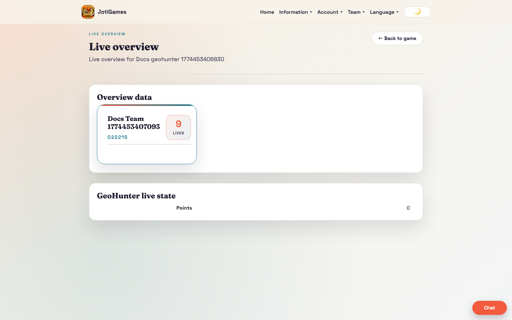

# Admin Live Overview

Route: `/admin/games/:gameId/live-overview`

## Purpose

The Admin Live Overview is the main runtime control and observation page for game staff during active play.

## What admins do here

- Monitor team status and scoreboard/highscore movement.
- Watch game-type specific live entities (for example markers, points, eggs, pending actions).
- Use operational controls and communication actions where available.
- Validate progression and intervene with admin workflows when needed.

## Notes

- This route is rendered by `ModuleOverviewPage`.
- Behavior differs by game type while keeping one consistent admin runtime entry point.

## Screenshot

