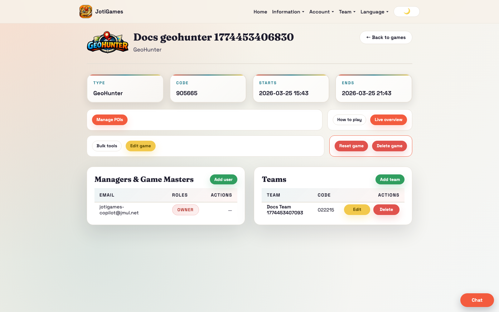

# Game Configuration Surfaces

Game configuration in JotiGames is split between a shared game setup page and game-type specific admin pages.

## Shared setup pages

- Create game: `/admin/games/new`
- Edit game basics: `/admin/games/:gameId/edit`
- Game details hub: `/admin/games/:gameId`

From the game details hub, admins navigate to the game-type specific configuration route.

## Game-specific configuration routes

- Exploding Kittens: `/admin/games/:gameId/cards` and `/admin/games/:gameId/cards/pdf`
- GeoHunter: `/admin/geohunter/:gameId/pois`
- Blind Hike: `/admin/blindhike/:gameId/configure`
- Resource Run: `/admin/resource-run/:gameId/nodes`
- Territory Control: `/admin/territory-control/:gameId/zones`
- Market Crash: `/admin/market-crash/:gameId/points`
- Crazy 88: `/admin/crazy88/:gameId/tasks`
- Courier Rush: `/admin/courier-rush/:gameId/configure`
- Echo Hunt: `/admin/echo-hunt/:gameId/beacons`
- Checkpoint Heist: `/admin/checkpoint-heist/:gameId/checkpoints`
- Pandemic Response: `/admin/pandemic-response/:gameId/hotspots`
- Birds of Prey: `/admin/birds-of-prey/:gameId/configure`
- Code Conspiracy: `/admin/code-conspiracy/:gameId/configure`

## Screenshot

