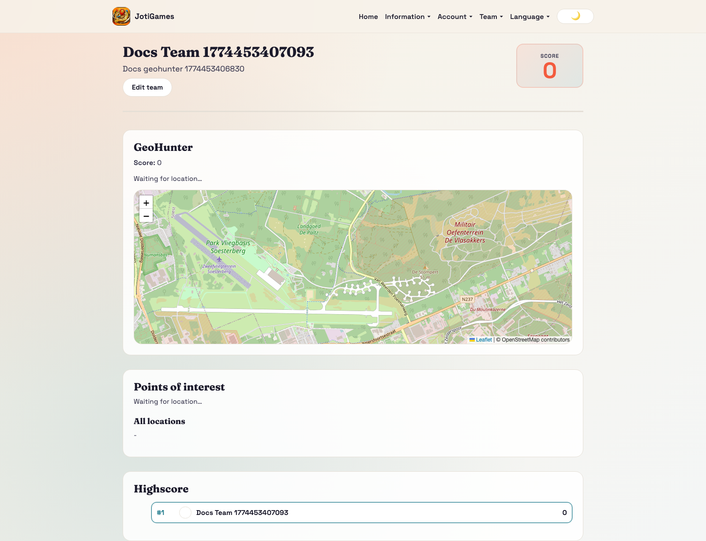

# Team Dashboard

Route: `/team`

## Purpose

The Team Dashboard is the runtime surface for players. It loads the active game context and renders game-type specific team interaction panels.

## What teams do here

- See current team state (score, status, game-specific counters).
- Perform game actions (examples: card actions, marker placement, trade actions, egg actions).
- Receive realtime updates from both team and game channels.
- View team-facing ranking/progress signals where supported.

## Data and realtime behavior

- Bootstraps from `GET /api/game/team/dashboard`.
- Subscribes to game and team websocket channels.
- Merges live updates into local state without full page reload.

## Screenshot

